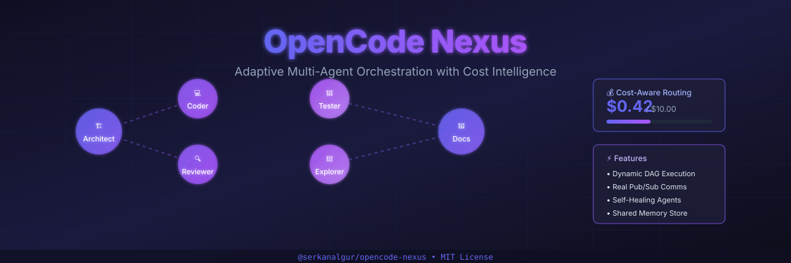

<div align="center">



[](https://www.npmjs.com/package/@serkanalgur/opencode-nexus)
[](https://www.npmjs.com/package/@serkanalgur/opencode-nexus)
[](https://github.com/serkanalgur/opencode-nexus/blob/main/LICENSE)
[](https://opencode.ai)
[](https://www.typescriptlang.org/)
[](https://github.com/sponsors/serkanalgur)

**Adaptive Multi-Agent Orchestration with Cost Intelligence**

[Installation](#installation) • [Quick Start](#quick-start) • [Features](#features) • [Agents](#agents) • [Tools](#tools) • [Configuration](#configuration) • [Development](#development)

</div>

---

## What is OpenCode Nexus?

OpenCode Nexus is an agent orchestration plugin for [OpenCode V2](https://opencode.ai) that spawns **real sub-agent sessions** with **cost-aware routing**, **DAG-based task execution**, **self-healing**, and a **TUI/web dashboard**.

### Key Capabilities

| Capability | Description |
|------------|-------------|
| **Real Sessions** | Each agent runs in its own OpenCode session via `ctx.session.create()` |
| **Role-Based Agents** | Architect, Coder, Reviewer, Tester, Explorer, Documenter — each with specialized prompts |
| **DAG Execution** | Tasks are parallelized based on dependency graphs with priority queuing |
| **Cost-Aware Routing** | Scores models by quality/cost/speed, selects optimal per task complexity |
| **Self-Healing** | Retries with exponential backoff, context transfer, escalation policies |
| **Web Dashboard** | A live view of sessions, agents, tasks, costs and config, served over HTTP + WebSocket (default port 4747) — started on request, never automatically |
| **TUI Dashboard** | Monitor agents, budget, and config from the terminal |
| **Team Mode** | Lead agent orchestrates specialist agents in parallel |
| **Todo & Goal Tracking** | Enforce task completion, persist objectives across sessions |
| **Persistent Memory** | SQLite-backed memory store with TTL and search |
| **Learning Module** | Pattern recognition from failures, confidence scoring |
| **JSONC Config** | Read/write project and global config files with comments |
| **OpenCode LSP opt-in** | On startup, inserts `"lsp": true` into your global `opencode.jsonc` if it isn't already there. That is the whole of it — Nexus does not read LSP state, manage servers, or report anything about them |
| **AST-Grep** | Pattern-aware code search and rewriting |
| **Security Scanning** | Automated secrets and vulnerability detection |
| **Slash Commands** | `/nexus`, `/nexus-web`, `/nexus-config`, `/nexus-model`, `/nexus-status`, `/nexus-dashboard`, `/nexus-reset` |

---

## Installation

```bash
# Using npm
npm install -g @serkanalgur/opencode-nexus

# Using bun
bun add -g @serkanalgur/opencode-nexus

# Add to OpenCode config
opencode plugin @serkanalgur/opencode-nexus --global
```

Or manually add to `~/.config/opencode/opencode.jsonc`:

```jsonc
{
  "plugins": ["@serkanalgur/opencode-nexus"]
}
```

### Auto-Setup

On first load, Nexus automatically:
- Creates `nexus-orchestrator` agent in `~/.config/opencode/agents/`
- Creates subagent files: `nexus-coder`, `nexus-explorer`, `nexus-reviewer`, `nexus-tester`, `nexus-architect`, `nexus-documenter`
- Enables LSP in OpenCode config
- Configures agent models from `.opencode/nexus.jsonc`

---

## Quick Start

### 1. Configure Agent Models

Press **Ctrl+N** or type `/nexus` to open the configuration dialog. Select where to save (project or global).

### 2. Use the Nexus Orchestrator

Select `nexus-orchestrator` as your primary agent, then:

```
# Spawn agents for tasks
Use nexus.spawn with role="coder" and task="Implement JWT auth"

# Wait for completion and get results
Use nexus.spawn with role="reviewer" and task="Review the implementation" and wait=true

# Delegate (convenience wrapper)
Use nexus.delegate with role="tester" and task="Write tests for auth module"

# Check progress
Use nexus.sessions

# Track goals
Use nexus.goal.set with description="Build complete auth system"
```

### 3. Use Slash Commands

```
/nexus              # Open full configuration dialog
/nexus web          # Open the web dashboard, if one is running
/nexus status       # Show the config summary
/nexus model coder  # Pick the model for a role
/nexus reset        # Reset configuration to defaults
```

---

## Features

### Cost-Aware Model Selection

Models are configured per role in `.opencode/nexus.jsonc`. Nexus scores models by quality, cost, and speed — then picks the optimal one:

```jsonc
{
  "models": {
    "architect": "opencode/muse-spark-1.3-contributor-free",
    "coder": "opencode/mimo-v2.6-flash-free",
    "reviewer": "opencode/muse-spark-1.2-contributor-free",
    "tester": "opencode-go/mimo-v2.5",
    "explorer": "opencode/big-pickle",
    "documenter": "opencode/big-pickle"
  }
}
```

When you call `nexus.spawn(role="coder")`, the coder model from config is used automatically.

### Self-Healing with Escalation

Failed tasks follow a 4-step escalation chain:

1. **Retry** — Exponential backoff (1s, 2s, 4s...)
2. **Respawn** — Collect context, spawn new agent with transferred state
3. **Fallback Model** — Try cheaper alternative model
4. **Alert** — Emit escalation event, mark as failed

### Web Dashboard

A live view of the orchestrator, served by an HTTP + WebSocket server on port 4747 (`127.0.0.1`).

**Nothing is listening until you ask for it.** The server is not started at
startup, and no command starts it implicitly. There is exactly one call that
does, and it has to come from the agent, because the server runs in the OpenCode
server process next to the orchestrator that feeds it:

```
Ask the agent: "start the nexus dashboard"
```

which calls `nexus.dashboard.start(port=4747, host="127.0.0.1")` and prints the
URL. **If the start fails, nothing is listening and no browser is opened** — the
tool says so and names the reason. The two ways it fails are a port already in
use (the bind is refused; pass a different `port`) and `dashboard.enabled: false`
in `nexus.jsonc`, which the tool reports by name.

Once it is running, the TUI command opens it for you:

```
/nexus web [port] [host]
```

`/nexus web` **cannot start the server** and does not pretend to. It asks
`http://host:port/api/health` whether a nexus dashboard is already serving there,
and then does one of three things:

| What it found | What it does |
|---|---|
| A nexus dashboard | Opens your browser at that URL |
| A different process on that port | Says so, opens nothing, suggests another port |
| Nothing there | Says so, opens nothing, and gives you the one `nexus.dashboard.start` call to make |

**How it stays current.** A WebSocket to `/ws/events` carries a throttled
`orchestrator:state` push — every state change schedules a full snapshot, at
most once a second — plus the thirteen orchestrator events as they happen. On
top of that, an **Auto-refresh** checkbox (on by default) has the page ask the
server for a fresh state every 5 seconds and poll `/api/health` and `/api/costs`,
the two things the socket does not carry. The push is what keeps the page fresh;
the interval is a belt-and-braces refresh you can switch off. The page also
shows how old the last snapshot is, and labels it stale past 15 seconds.

**What it shows:**
- **Sessions** — one row per session nexus owns, is still collecting cost from,
  or has abandoned, with each one's state (`running` / `idle` / `abandoned` /
  `settled`), last read token count, and unbilled spend. Rows with **no owning
  agent** are called out in a banner above the table, because a session that is
  still generating after its agent was terminated keeps spending and nothing is
  collecting that spend — a case that was invisible on every layer before.
  This list is nexus's own bookkeeping, not an enumeration of every open session
  on the server, and the page says so on the section itself.
- **Agents** — role, status, model, session id, and metrics
- **Budget** — spend against the configured cap, with the alert threshold marked
- **Tasks and DAG** — the task list, and a graph drawn from the dependency edges
  the state actually reports. Edges pointing at tasks that are not in the
  snapshot, self-edges, and cycles are counted and reported in the section note
  rather than silently not drawn.
- **Cost breakdown** — by agent and by model, read from `/api/costs`, which
  covers the full history rather than only the live agents
- **Configuration (read-only)** — the resolved config the orchestrator reports
  as in force, plus a `read-only` JSON viewer. The write path was deliberately
  removed rather than left broken: it used to post a `config:update` message
  that the server does not handle, so the Apply button reported success and
  nothing happened. There is no auth story for writes and the socket is a
  localhost server answering with `CORS: *`, so no write path was added to
  replace it — edit `nexus.jsonc` instead.
- **Activity log** — every event the broadcaster forwards, each delivered once

**Stop the dashboard:**
```
Ask the agent to call nexus.dashboard.stop
```
This stops the HTTP/WebSocket server only. The orchestrator, its agents and its
sessions keep running.

### Team Mode

Create a team of specialist agents working in parallel:

```
nexus.team.create(name="auth-team", leadRole="architect")
nexus.team.addMember(teamId="...", role="coder", model="opencode/mimo-v2.6-flash-free")
nexus.team.addMember(teamId="...", role="reviewer", model="opencode/muse-spark-1.2-contributor-free")
nexus.team.activate(teamId="...")
```

### Todo & Goal Tracking

Track tasks and persist objectives across sessions:

```
nexus.todo.add(description="Implement auth middleware")
nexus.todo.list()
nexus.todo.complete(id="...")

nexus.goal.set(description="Build complete auth system")
nexus.goal.status()
nexus.goal.complete()
```

### LSP Integration

OpenCode's built-in LSP servers are auto-enabled. Supports 30+ languages including TypeScript, Python, Go, Rust, and more.

### AST-Grep

Pattern-aware code search and rewriting:

```
nexus.astgrep.search(pattern="console.log($$$)", language="typescript", directory="src/")
nexus.astgrep.rewrite(pattern="var $X", rewrite="const $X", language="typescript", directory="src/")
```

### Security Scanning

Automated secrets and vulnerability detection:

```
nexus.security.scan(content="const API_KEY = \"sk-123\"", filename="config.ts")
```

### Persistent Memory

SQLite-backed memory store that survives restarts:

```typescript
orchestrator.memoryStore.set({
  key: 'api-pattern',
  value: { endpoint: '/users', method: 'GET' },
  scope: 'project',
  author: 'architect',
  confidence: 0.9,
  tags: ['api', 'design']
})
```

### Learning Module

Records failure patterns and solutions, building confidence over time:

```typescript
const solutions = orchestrator.learning.findSolutions('TypeScript TS2345 error')
// → [{ entry: { solution: 'Add type cast', confidence: 0.85 }, similarity: 0.7 }]
```

### Preset Configurations

| Preset | Models | Budget | Self-Healing |
|--------|--------|--------|--------------|
| **minimal** | Gemini Flash | $1 | Off |
| **balanced** | Claude/GPT mix | $10 | On (3 retries) |
| **enterprise** | Top-tier | $50 | On (5 retries) |
| **cost-optimized** | Cheapest | $3 | On (2 retries) |

---

## Agents

Nexus creates 7 agent files in `~/.config/opencode/agents/`:

| Agent | Mode | Purpose |
|-------|------|---------|
| `nexus-orchestrator` | primary | Main orchestrator — decompose, dispatch, integrate |
| `nexus-architect` | subagent | System design and architecture |
| `nexus-coder` | subagent | Implement code tasks |
| `nexus-reviewer` | subagent | Code review (read-only) |
| `nexus-tester` | subagent | Write and run tests |
| `nexus-explorer` | subagent | Explore codebases (read-only) |
| `nexus-documenter` | subagent | Write documentation |

### Clarify Skill

When instructions are ambiguous, use `nexus.clarify`:

```
nexus.clarify(question="Should I use JWT or OAuth?", options="JWT, OAuth", assumption="JWT")
```

---

## Tools

| Tool | Description | Input |
|------|-------------|-------|
| `nexus.spawn` | Spawn a sub-agent | `{ role, task, model?, wait?, timeout? }` |
| `nexus.delegate` | Spawn + wait + result | `{ role, task, model?, timeout? }` |
| `nexus.sessions` | List active sessions | `{}` |
| `nexus.background` | Move agents to background | `{}` |
| `nexus.result` | Get agent result | `{ sessionID }` |
| `nexus.status` | Orchestrator status | `{ detailed? }` |
| `nexus.costs` | Cost report & budget | `{}` |
| `nexus.forecast` | Predict costs | `{ tasks }` |
| `nexus.model.costs` | Show/set model pricing | `{ model?, setInput?, setOutput? }` |
| `nexus.preset` | Apply preset config | `{ name }` |
| `nexus.config.save` | Save config to disk | `{ level: 'project' \| 'global' }` |
| `nexus.config.init` | Initialize config files | `{ level }` |
| `nexus.dashboard.start` | Start the web dashboard server (port must be free) | `{ port?, host? }` |
| `nexus.dashboard.stop` | Stop the web dashboard server | `{}` |
| `nexus.todo.add` | Add a todo item | `{ description, assignedTo? }` |
| `nexus.todo.list` | List all todos | `{}` |
| `nexus.todo.complete` | Complete a todo | `{ id }` |
| `nexus.todo.stats` | Todo statistics | `{}` |
| `nexus.goal.set` | Set a goal | `{ description, autoContinue? }` |
| `nexus.goal.status` | Current goal status | `{}` |
| `nexus.goal.complete` | Complete goal | `{}` |
| `nexus.goal.list` | List all goals | `{}` |
| `nexus.team.create` | Create a team | `{ name, leadRole }` |
| `nexus.team.addMember` | Add team member | `{ teamId, role, model }` |
| `nexus.team.status` | Team status | `{ teamId? }` |
| `nexus.team.activate` | Start team | `{ teamId }` |
| `nexus.performance.scores` | Performance scores | `{}` |
| `nexus.performance.best` | Best model for role | `{ role }` |
| `nexus.history.list` | Execution history | `{ count? }` |
| `nexus.history.stats` | Execution statistics | `{}` |
| `nexus.astgrep.search` | Search AST patterns | `{ pattern, language, directory }` |
| `nexus.astgrep.status` | Check ast-grep install | `{}` |
| `nexus.security.scan` | Scan for security issues | `{ content, filename? }` |
| `nexus.clarify` | Ask clarifying question | `{ question, options?, assumption? }` |
| `nexus.worktree.enable` | Enable worktree isolation | `{ repoRoot? }` |
| `nexus.worktree.list` | List worktrees | `{}` |
| `nexus.worktree.disable` | Disable worktrees | `{}` |

---

## TUI Commands

The TUI plugin registers exactly these slash commands. With no argument,
`/nexus` opens the full configuration dialog; with one, it dispatches to a
subcommand (`config`/`c`, `status`/`s`, `dashboard`/`d`, `web`/`w`,
`model`/`m`, `reset`).

| Command | Alias | Description |
|---------|-------|-------------|
| `/nexus` | `Ctrl+N` | Full configuration dialog, or a subcommand |
| `/nexus-web` | `/nw` | Open the web dashboard if one is already serving; otherwise say how to start it. Does not start the server — see [Web Dashboard](#web-dashboard) |
| `/nexus-config` | `/nc` | Configure models & budget |
| `/nexus-model` | `/nm` | Select a model for a role |
| `/nexus-status` | `/ns` | Show the config summary |
| `/nexus-dashboard` | `/nd` | Config, budget and dashboard-status overview. Prints text; starts nothing |
| `/nexus-reset` | — | Reset all settings to defaults |

A prompt beginning `/nexus …` typed into the composer is a *different* thing: it
is intercepted by a prompt hook and routed to `orchestrator.handleCommand()`,
which understands only `status`, `agents`, `costs`, `pause`, `resume` and
`dashboard` (which returns the state as JSON). Anything else answers
`Unknown command`. The table above is the TUI palette.

---

## Configuration

### Agent Models

Configure via `/nexus` or `Ctrl+N`:

```
🏗️ Architect: opencode/muse-spark-1.3-contributor-free
💻 Coder:     opencode/mimo-v2.6-flash-free
🔍 Reviewer:  opencode/muse-spark-1.2-contributor-free
🧪 Tester:    opencode-go/mimo-v2.5
🔬 Explorer:  opencode/big-pickle
📝 Documenter: opencode/big-pickle
```

### Web Dashboard

`.opencode/nexus.jsonc` (project) and `~/.config/opencode/nexus.jsonc` (global)
both accept:

```jsonc
{
  "dashboard": {
    "enabled": true,   // false makes every start attempt refuse, and say so
    "port": 4747,      // default port; startDashboard({port}) still wins
    "host": "127.0.0.1"
  }
}
```

The server has no authentication, which is why `host` defaults to loopback.
Leave it there unless you have put your own authentication in front of it.

### Custom Roles

Define your own agent roles:

```jsonc
{
  "customRoles": [
    {
      "name": "security-auditor",
      "displayName": "Security Auditor",
      "emoji": "🔐",
      "prompt": "You are a security auditor...",
      "model": "anthropic/claude-sonnet-4-6"
    }
  ]
}
```

### Task Templates

```
nexus.template(name="list")      — Show available templates
nexus.template(name="feature")   — Full feature pipeline
nexus.template(name="bugfix")    — Bug investigation and fix
nexus.template(name="refactor")  — Code refactoring pipeline
nexus.template(name="documentation") — Documentation update
```

---

## Architecture

```
┌─────────────────────────────────────────────────────────────┐
│                      NEXUS PLUGIN                            │
│                                                              │
│  ┌────────────────────────────────────────────────────┐     │
│  │              SERVER PLUGIN (index.ts)                │     │
│  │  • 40+ tool registrations                            │     │
│  │  • Auto-creates agent files; opts OpenCode into LSP  │     │
│  │  • Config file loading and creation                 │     │
│  └────────────────────────────────────────────────────┘     │
│                                                              │
│  ┌────────────────────────────────────────────────────┐     │
│  │            ORCHESTRATOR (orchestrator.ts)            │     │
│  │  • Real OpenCode session creation                    │     │
│  │  • DAG execution with priority queuing               │     │
│  │  • Cost-aware model routing (scored selection)       │     │
│  │  • Self-healing with 4-step escalation               │     │
│  │  • Context transfer to respawned agents              │     │
│  │  • Deadlock detection (cycle finding)                │     │
│  │  • Todo/Goal tracking                                │     │
│  │  • Team management                                   │     │
│  └────────────────────────────────────────────────────┘     │
│                                                              │
│  ┌────────────────────────────────────────────────────┐     │
│  │                    MODULES                          │     │
│  │  Health Monitor │ Learning │ Message Store (SQLite) │     │
│  │  Persistent Mem │ Fan-Out  │ Notifications (OS)     │     │
│  │  State Broadcaster │ Module Registry │ Security     │     │
│  │  Cost Forecaster │ Performance Tracker │ AST-Grep   │     │
│  └────────────────────────────────────────────────────┘     │
│                                                              │
│  ┌────────────────────────────────────────────────────┐     │
│  │              WEB DASHBOARD                          │     │
│  │  • Bun.serve() HTTP + WebSocket (port 4747)         │     │
│  │  • DAG viz, cost chart, read-only config, sessions  │     │
│  │  • Started on request; throttled push + poll        │     │
│  └────────────────────────────────────────────────────┘     │
│                                                              │
│  ┌────────────────────────────────────────────────────┐     │
│  │              AGENTS (auto-created)                   │     │
│  │  nexus-orchestrator (primary)                       │     │
│  │  nexus-architect, nexus-coder, nexus-reviewer        │     │
│  │  nexus-tester, nexus-explorer, nexus-documenter      │     │
│  └────────────────────────────────────────────────────┘     │
└─────────────────────────────────────────────────────────────┘
```

---

## Development

```bash
# Clone the repo
git clone https://github.com/serkanalgur/opencode-nexus.git
cd opencode-nexus

# Install dependencies
bun install

# Build
bun run build

# Run tests
bun test

# Type check
npx tsc --noEmit
```

---

## Contributing

Contributions are welcome! Please see [CONTRIBUTING.md](CONTRIBUTING.md) for details.

---

## License

MIT License - see [LICENSE](LICENSE) for details.

---

<div align="center">

**Built with ❤️ by [Serkan Algur](https://github.com/serkanalgur)**

[](https://github.com/serkanalgur)
[](https://www.npmjs.com/package/@serkanalgur)

</div>
