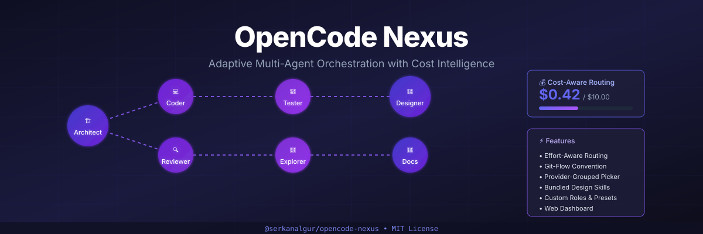

<div align="center">



[](https://www.npmjs.com/package/@serkanalgur/opencode-nexus)
[](https://www.npmjs.com/package/@serkanalgur/opencode-nexus)
[](https://github.com/serkanalgur/opencode-nexus/stargazers)
[](https://github.com/serkanalgur/opencode-nexus/blob/main/LICENSE)
[](https://socket.dev/npm/package/@serkanalgur/opencode-nexus/overview)
[](https://opencode.ai)
[](https://www.typescriptlang.org/)
[](https://github.com/sponsors/serkanalgur)

**Adaptive Multi-Agent Orchestration with Cost Intelligence**

[Installation](#installation) • [Quick Start](#quick-start) • [Features](#features) • [Agents](#agents) • [Tools](#tools) • [Configuration](#configuration) • [Development](#development)

</div>

---

## What is OpenCode Nexus?

OpenCode Nexus is an agent orchestration plugin for [OpenCode V2](https://opencode.ai) that spawns **real sub-agent sessions** with **cost-aware routing**, **DAG-based task execution**, **self-healing**, and a **TUI/web dashboard**.

### Key Capabilities

| Capability | Description |
|------------|-------------|
| **Real Sessions** | Each agent runs in its own OpenCode session. The preferred path dispatches through OpenCode's built-in `subagent` tool so the child is parent-linked; `ctx.session.create()` is the fallback when no parent tool context is available, and the spawn is logged as degraded |
| **Role-Based Agents** | Architect, Coder, Reviewer, Tester, Explorer, Documenter — each with specialized prompts |
| **Custom Roles** | Your own roles, from `.opencode/nexus.jsonc` or `nexus.roles.add` for the session |
| **DAG Execution** | Tasks are parallelized based on dependency graphs with priority queuing |
| **Cost-Aware Routing** | Scores models by quality and cost, selects optimal per task complexity. A speed score is computed and reported but does not affect selection |
| **Self-Healing** | Retries with exponential backoff, context transfer, then an escalation policy. The retry counts are configurable; the fallback model list is a hardcoded default, not file-configurable |
| **Config Hot-Reload** | Edits to `nexus.jsonc` take effect without a restart — a `filesystem.changed` fast path plus a 2s poll of the two config files, debounced 150ms |
| **Web Dashboard** | A live view of sessions, agents, tasks, costs and config, served over HTTP + WebSocket (default port 4747) — started on request from `/nexus-dashboard` or the agent, never automatically |
| **TUI Dashboard** | Monitor agents, budget, and config from the terminal |
| **Team Mode** | Lead agent orchestrates specialist agents in parallel |
| **Todo & Goal Tracking** | Enforce task completion, persist objectives across sessions |
| **Persistent Memory** | SQLite store, three tools, and automatic retrieval of notes keyed to a task's files. **Nothing is ever written automatically** — a miss injects silence, never a guess |
| **Learning Module** | Pattern recognition from failures, confidence scoring |
| **JSONC Config** | Read/write project and global config files with comments |
| **OpenCode LSP opt-in** | On startup, inserts `"lsp": true` into your global `opencode.jsonc` if it isn't already there. That is the whole of it — Nexus does not read LSP state, manage servers, or report anything about them |
| **AST-Grep** | Pattern-aware code search |
| **Security Scanning** | Regex detection of hardcoded secrets and known-dangerous constructs |
| **Slash Commands** | `/nexus`, `/nexus-dashboard`, `/nexus-web`, `/nexus-overview`, `/nexus-config`, `/nexus-model`, `/nexus-status`, `/nexus-reset` |

---

## Installation

```bash
# Install the plugin and add it to your global OpenCode config
opencode plugin add @serkanalgur/opencode-nexus
```

This package is an OpenCode plugin, not a command-line tool: it declares no
`bin`, so there is nothing for a global install to put on your `$PATH` and no
CLI to invoke afterwards. `opencode plugin` takes a subcommand (`list`, `add`,
`check`, `update`, `remove`) and has no `--global` flag.

Or manually add to `~/.config/opencode/opencode.jsonc`:

```jsonc
{
  "plugins": ["@serkanalgur/opencode-nexus"]
}
```

### Auto-Setup

On every plugin load, Nexus:
- Writes `nexus-orchestrator` to `~/.config/opencode/agents/nexus-orchestrator.md`
- Writes the seven subagent files: `nexus-coder`, `nexus-explorer`, `nexus-reviewer`, `nexus-tester`, `nexus-architect`, `nexus-documenter`, `nexus-designer`
- Reads role→model mappings from `.opencode/nexus.jsonc` (and the global config) and resolves them per spawn; the generated agent files carry no model pin
- Best-effort: if `~/.config/opencode/opencode.jsonc` already exists and does not already mention `"lsp"`, inserts `"lsp": true`; silently does nothing if the file is absent

**The agent files are rewritten on every load, not created once.** Any hand-edit
to them is lost the next time OpenCode starts. Edit `nexus.jsonc` for models and
budget, or `nexus.roles.add` for an extra role; do not edit the generated agent
files.

---

## Quick Start

### 1. Configure Agent Models

Press **Ctrl+N** or type `/nexus` to open the [configuration
dialogs](#the-configuration-dialogs). You choose a block, you choose a setting
in it, and you choose where a save writes — this project or your global config.
Nothing is written until you choose **Save and close**. To skip straight to one
role's model, run `/nexus model <role>`.

### 2. Use the Nexus Orchestrator

Select `nexus-orchestrator` as your primary agent, then:

```
# Spawn agents for tasks
Use nexus.spawn with role="coder" and task="Implement JWT auth"

# Wait for completion and get results
Use nexus.spawn with role="reviewer" and task="Review the implementation" and wait=true

# Delegate (convenience wrapper)
Use nexus.delegate with role="tester" and task="Write tests for auth module"

# Check progress
Use nexus.sessions

# Track goals
Use nexus.goal.set with description="Build complete auth system"
```

### 3. Use Slash Commands

```
/nexus              # Open the configuration dialogs
/nexus dashboard    # Start the web dashboard and open it in your browser
/nexus status       # Show the config summary
/nexus model coder  # Pick the model for a role
/nexus reset        # Reset configuration to defaults
/nexus agents       # List spawned agents  (answered by the server)
/nexus costs        # Cost report         (answered by the server)
/nexus pause        # Pause the orchestrator      (answered by the server)
/nexus resume       # Resume the orchestrator     (answered by the server)
```

Anything the TUI does not handle itself is submitted to the OpenCode server
verbatim and answered there, so a subcommand added to the server works from the
TUI without a TUI change. `/nexus agents reviewer` forwards its filter. See
[TUI Commands](#tui-commands).

---

## Features

### Cost-Aware Model Selection

Models are configured per role in `.opencode/nexus.jsonc`. Nexus scores models by quality and cost, then picks the optimal one. A speed score is computed and reported alongside, but it is not a term in the overall score, so it never affects which model is selected.

Example (the model ids below are illustrative — use whatever your provider offers):

```jsonc
{
  "models": {
    "architect": "opencode/muse-spark-1.3-contributor-free",
    "coder": "opencode/mimo-v2.6-flash-free",
    "reviewer": "opencode/muse-spark-1.2-contributor-free",
    "tester": "opencode-go/mimo-v2.5",
    "explorer": "opencode/big-pickle",
    "documenter": "opencode/big-pickle",
    "designer": "opencode/big-pickle"
  }
}
```

Every role is configurable this way, `designer` included — it is a full role in the
role picker, not a fixed one. When you call `nexus.spawn(role="coder")`, the coder
model from config is used automatically. Every role also has a bundled default, so
leaving a role out of the file does not leave it unconfigured — it runs on that
role's default rather than on the coder's. Emptying an entry asks for the same
thing, which is what the picker's **Use default** row does.

Which model a preset gives each role is a judgement, not a constant. The `minimal`
preset puts the designer on a flash model because its thesis is cheap models against
a $1 ceiling — a frontier model there would cost more than the six roles it plans
for. The `enterprise` preset deliberately does *not* give the designer the frontier
model the reviewer gets: the reviewer catches defects in a diff that exists, whereas
the designer's output is a judgement about something that does not, where a confident
wrong answer is caught by nobody downstream.

`nexus.model.costs` with no arguments lists every loaded model, grouped under one
heading per provider — `Anthropic`, `OpenCode Go` — so a multi-provider install
reads as sections instead of one flat run of `providerID/modelID` keys. The
heading is the provider's display name, and a provider OpenCode has not published
a name for falls back to its raw id. Groups are ordered by display name and
models by id within their group, and a model priced by hand under a bare id goes
into a `No provider (bare model id)` bucket rather than being dropped or filed
under a provider it does not belong to. A long catalogue is cut at 12 providers,
and the closing line states how many groups and models were left out.

Each row shows its input and output price in USD per 1K tokens, in the same
format the TUI model picker uses — the two surfaces share one formatter, so they
cannot print different numbers for the same model. The list prints **one rate
pair per model**: it is a catalogue, and a four-rate-per-tier block per model is
unreadable in a list column. Cache rates and every tier above the first are
therefore **not in the list** — pass `model=<provider/id>` and you get that one
model in full, every tier, with `cache_read` and `cache_write`. The threshold a
row names is where its displayed rate stops applying; the rate that takes over is
in the per-model view.

Provider names come from a single snapshot the server loads at startup, and the
dashboard and this tool both read it — so the two can never print different
headings for the same models. The cost of one snapshot is that a provider added,
renamed or removed mid-session keeps its boot-time label (or its raw id, if it
had none) until the server restarts; the TUI model picker memoises names per
project directory for the same reason. A stale name is a wrong *label* on rows
that are otherwise correct — never a missing model and never a wrong price.

**Effort is not part of the score.** A model with a cheaper per-token rate still
wins on the same quality/cost comparison it always did, and the quality/cost
weight split is unchanged. A variant moves token volume, not rate — see
[Effort-Aware Model Selection](#effort-aware-model-selection) for what does
choose an effort.

### Effort-Aware Model Selection

Off by default. With it on, Nexus asks the model that won selection to run at a
reasoning effort matched to how hard it judged the task, instead of leaving that
to the host's default.

`.opencode/nexus.jsonc` (project) and `~/.config/opencode/nexus.jsonc` (global)
both accept:

```jsonc
{
  "effort": {
    "enabled": false,        // master switch; nothing below is consulted when off
    "maxEffort": "high",     // ceiling: none, minimal, low, medium, high, xhigh, max
    "minDifficulty": 0       // 0-100; a task must REACH this to be given any effort
  }
}
```

**The rule, as one sentence.** A task is asked for the highest published level at
or below `min(difficultyBucket(overall), maxEffort)`, and is asked for **nothing**
only when `overall < minDifficulty`. The threshold is the single setting that
says "too easy to bother"; the difficulty table never says it, and its lowest
bucket is the floor `low`. The threshold is checked at `src/orchestrator.ts:4279`
and the ceiling is taken as the lower of the two at `src/orchestrator.ts:4288`.

**Higher effort means more reasoning tokens at the same per-token rate.** It
does not make a token cheaper or dearer, so nothing in the cost arithmetic
changes: a variant carries no price of its own (`ModelVariant` has no `cost`
field), so `p/m` and `p/m#high` are the same rate, and the extra reasoning
tokens are billed by the existing measured path, which charges reasoning tokens
alongside output. There is deliberately no variant axis on the price tiers —
their only axis is context size.

**What "how hard" means.** The difficulty is the `overall` score from the
analysis the orchestrator already runs on every spawn, and that score already
decides the quality/cost weight split, so ranking and effort cannot disagree
about where a task stops being easy. The buckets are `0-40 → low`, `41-70 →
medium`, `71-85 → high`, `86-95 → xhigh`, `96-100 → max`
(`src/model-ref.ts:410-416`); the `40` and `70` boundaries are the ones the
existing weight split already uses, so the table mirrors the ranker's three
regimes — cheap, balanced, quality-favoured — one bucket each. There is no
"don't bother" bucket: the table tiles `0-100` with no gap and runs *upward* from
`low`, which is what makes `minDifficulty` the only place that decision can be
made. That analysis is a heuristic, not a measurement — it reads no source files
and guesses a code size from the file count — so the `85` and `95` boundaries are
a policy claim rather than a fact about your task.

**`none` is a published level, not a difficulty bucket.** The seven names
(`none`, `minimal`, `low`, `medium`, `high`, `xhigh`, `max` —
`src/model-ref.ts:349`) are the vocabulary of what models *publish*; a real
observed catalogue is `["none","medium","high","xhigh"]`. The five names the
difficulty table can *produce* are the upper five of those. `none` and `minimal`
are still honoured when a model publishes them and nothing better qualifies
under the ceiling — a model publishing only `none` under a `low` ceiling is
answered `none` — but no difficulty score selects them. Raising `minDifficulty`
is how you stop spending effort on easy work; the table has no opinion about it.

**Only published levels are ever requested.** Nexus takes the highest level the
model actually publishes that is at or below the ceiling. A model publishing
`low`, `high` and `max` asked to run at `high` gets `high`; one publishing none
of those gets **no suffix at all**, because picking any of them would spend more
than the ceiling allows. `maxEffort: "high"` is therefore a real cost control
rather than a label: at the default, the two hardest buckets (`xhigh` and `max`)
are not reachable, because an estimate of how hard a task is does not justify
several times the reasoning budget to answer it. Raise it if you disagree.

**A ceiling below the floor is honoured, not rounded up.** `maxEffort: "minimal"`
is a level the difficulty table cannot produce, and it still binds: the answer is
whatever the model publishes at or below `minimal`, which for most catalogues is
nothing at all — reported as such, never quietly raised to `low`. Rounding up
would spend more reasoning budget than the ceiling allows, which is the one thing
a cost control must not do.

**An effort you named yourself is not rewritten — but on the DAG path it is only
a candidate.** A configured `anthropic/claude-sonnet-4-6#minimal` is never
reinterpreted: if the model publishes that name, Nexus uses that name, and if it
does not, Nexus says so in the selection's reasoning and leaves your value
alone. What it is *not* is a guarantee that this model runs. When a task is
scheduled through the DAG, `selectBestModel` scores your configured reference
alongside five built-in alternatives and picks the highest scorer — so a
cheaper or better-quality alternative can win, and then **neither the model nor
the variant is used**: the winner's `model` and `variant` are what the spawn
carries, and your `#minimal` does not travel with it. On the direct-spawn path,
where you name the model yourself, nothing ranks it and it runs as written.

**When no effort can be chosen, it says which reason.** The `nexus.spawn` result
line `🤖 Model reasoning:` carries the selection's explanation, and for effort it
distinguishes: the model publishes no variants; the catalogue has no entry for
it, so nothing can be verified; the task is easier than `minDifficulty`; or every
published level is above the ceiling. The first three all mean "no suffix", and
reporting them separately is what keeps a missing variant from being
indistinguishable from a typo. When one is chosen, the same line names the
level, the difficulty, the ceiling, and what the model publishes — so a surprise
in the bill can be traced to the decision that caused it.

**Every key is read.** `enabled` decides whether the automatic choice is made at
all — with it off, no selection outcome differs in any way, and a `#variant` you
wrote behaves exactly as before. `maxEffort` clamps the choice, and
`minDifficulty` decides which tasks get one at all: at the default `0` every task
clears the threshold and the floor bucket `low` applies to all of them, so the
default is "never skip", not "skip nothing because the table already did". Any
value you set moves the outcome for at least one score — `0` differs from `1` at
difficulty 0, and every threshold from `2` to `100` differs from the one below it
at difficulty `threshold - 1`. Values outside `0-100` are clamped to that range
rather than rejected (`src/config.ts:258`). The block is merged **field by
field** across the storage (TUI) > project > global > constructor levels, so a
level that sets only `enabled` does not blank out the two numbers resolved
beneath it.

### Self-Healing with Escalation

Failed tasks follow a 4-step escalation chain:

1. **Retry** — Exponential backoff: attempt *n* waits `retryDelay * 2ⁿ`, so the
   default `retryDelay: 1000` gives 1s, 2s, 4s
2. **Respawn** — Collect context, spawn new agent with transferred state
3. **Fallback Model** — Try a cheaper alternative model. The fallback list (`google/gemini-2.5-flash`, then `anthropic/claude-haiku-4-5`) is a hardcoded default in `src/orchestrator.ts`, not something `nexus.jsonc` can change
4. **Alert** — Emit escalation event, mark as failed

The retry count, retry delay and context-transfer toggle are configurable under
`selfHealing`; the fallback models are not. `selfHealing` has exactly those four
keys, and all four are read. `retryDelay` in particular is file-settable **and
file-effective**: it is merged field by field like every other block, pushed
into the escalation policy at `initialize()` and on every reload, and it is the
value the backoff multiplies — so `retryDelay: 4321` waits 4321 ms, not 1000 ms
with a comment saying otherwise. The **2** in the backoff is a literal in
`handleFailure` and is not configurable — a `backoffMultiplier` key used to sit
in this block and in the dashboard's config panel, where it was rendered as
"× 3.50" while the code went on computing `Math.pow(2, retryCount)`. It has been
removed rather than left to look like a control.

### Keys Nexus does not read

If a `nexus.jsonc` carries a key no current Nexus reads — a leftover from an
older version, or a typo — Nexus says so once, on load, naming every one of them
and the file it came from:

```
[nexus] ~/.opencode/nexus.jsonc has 2 key(s) Nexus does not read:
budget.maxCostPerAgent, selfHealing.backoffMultiplier. They are ignored, and the
next save from the config dialogs will remove them from the file.
```

This is not a warning about a mistake you have to avoid; it is the upgrade
notice. Blocks whose key set is yours to invent — `models` and `customRoles` —
are never reported, because a role name and a custom role are not stale keys.

### Budget

`budget` has **three** file-settable keys, and each one is read:

| Key | What it does |
|-----|--------------|
| `maxTotalCost` | The run's total ceiling. Compared against `totalSpent` on every charge |
| `alertThreshold` | The remaining *fraction* of `maxTotalCost` at or below which the low-budget alert fires |
| `maxCostPerTask` | An **advisory** per-task ceiling. Notifies once per task, naming the task, when that task's running total crosses it |

All three reach enforcement from the file. They are merged **field by field**
across storage (TUI) > project > global > constructor, pushed into the
orchestrator at `initialize()` and again on every reload, and the single value
they land in is the one the dashboard and `/nexus status` display — so what you
see is what is in force. (The one exception is a programmatic run: an
`ExecutionRequest.budget` replaces the ceiling for that run and survives later
reloads, so what the config dialogs and `/nexus status` show stays the file's
value while the run is held to the caller's. That is deliberate — a reload mid-run must not move the ceiling
out from under spend already measured against the old one.) A `budget` block is
written out in full on save, so editing one of these cannot delete the others.

`maxCostPerTask` is advisory for the same reason `maxTotalCost` is:
a turn already in flight cannot be interrupted, because its cost is only known
once it returns or times out. So it reports an overspend after the fact and
**stops nothing** — no task is cancelled, no retry is suppressed, no spend is
un-charged. What it gives you is the one thing the run total cannot: *which
task* ran the bill up.

**`hardLimit` is a fourth key on the budget, and it is deliberately not
file-settable.** It is a real, enforced switch — `true` makes `maxTotalCost`
**terminal**: the run pauses and notifies, and `maxCostPerTask` is not the only
thing that can stop work. It is reachable programmatically (a constructor
argument, or an `ExecutionRequest.budget` for one run) and it survives a config
reload, but there is no `hardLimit` in `NexusFullConfig.budget`, so no file,
preset or config-dialog row can set it. That is a decision, not an oversight: the
alternative was a fourth file key that turns a paused run back on, and a budget
you cannot stop work on is a limit rather than a report. If you need the
terminal behaviour, embed the orchestrator and pass it. **If you were told to
set `hardLimit: true` in `nexus.jsonc`, that advice was wrong** — the key there
is read by nothing, and Nexus now says so on load rather than ignoring it in
silence.

There is no per-agent ceiling. A `maxCostPerAgent` key used to sit here, in all
four presets and in the dashboard, where the page scaled every agent's cost bar
by it and captioned the result "of $N per-agent ceiling · OVER CEILING" — with
nothing enforcing it. Agents are long-lived and have no task boundary, so a
per-agent ceiling has no well-defined denominator; it has been removed. The
agent cost bars are now scaled by `maxTotalCost`, the one cap that is real.

### Web Dashboard

A live view of the orchestrator, served by an HTTP + WebSocket server on port 4747 (`127.0.0.1`).

**Nothing is listening until you ask for it.** The server is not started at
startup, and no command starts it implicitly. The start has to happen in the
OpenCode *server* process, next to the orchestrator that feeds it, and there are
two ways to reach it:

```
/nexus dashboard [port] [host]      # from the TUI — starts it and opens it
/nexus dashboard stop               # from the TUI — forwarded to the server
/nexus dashboard state              # from the TUI — forwarded to the server
Ask the agent: "start the nexus dashboard"
```

The TUI command submits `/nexus dashboard [port] [host]` to that server process,
whose prompt hook routes it to the orchestrator; the agent's route calls
`nexus.dashboard.start(port=4747, host="127.0.0.1")` directly. Both end at the
same start, and both print the URL it bound. **If the start fails, nothing is
listening and no browser is opened** — the reason is reported, and no URL is
offered for a server that is not there. The ways it fails are a port already in
use (the bind is refused; pass a different `port`) and `dashboard.enabled: false`
in `nexus.jsonc`, which is refused by name.

Once it is serving, the same command opens it:

```
/nexus dashboard [port] [host]      # /nexus web is an alias of this
/nexus web [port] [host]
```

The TUI cannot start the server itself — its process has no orchestrator, no
module registry and no way to invoke a tool — but it can reach the process that
has all three, and it can ask whether anything is listening. So the command asks
`http://host:port/api/health` first, and then does one of four things:

| What it found | What it does |
|---|---|
| A nexus dashboard | Opens your browser at that URL. Nothing is started a second time |
| A different process on that port | Says so, opens nothing, suggests another port |
| Nothing there | Submits `/nexus dashboard [port] [host]` to the server, waits for the port to answer, then opens the browser |
| Still nothing after ~3s | Says the start did not confirm, opens nothing, and points at the command's own reply for the reason |

The browser opens **only** after a confirmed listen. That is the whole point of
the wait: a browser pointed at a dead address gives a connection-refused page,
which looks like the dashboard failing rather than the dashboard not running.

**How it stays current.** A WebSocket to `/ws/events` carries a throttled
`orchestrator:state` push — every state change schedules a full snapshot, at
most once a second — plus the thirteen orchestrator events as they happen. On
top of that, an **Auto-refresh** checkbox (on by default) has the page ask the
server for a fresh state every 5 seconds and poll `/api/health` and `/api/costs`,
the two things the socket does not carry. The push is what keeps the page fresh;
the interval is a belt-and-braces refresh you can switch off. The page also
shows how old the last snapshot is, and labels it stale past 15 seconds.

**What it shows:**
- **Sessions** — one row per session nexus owns, is still collecting cost from,
  or has abandoned, with each one's state (`running` / `idle` / `abandoned` /
  `settled`), age, last read token count, and unbilled spend. Rows with **no
  owning agent** are called out in a banner above the table, because a session
  that is still generating after its agent was terminated keeps spending and
  nothing is collecting that spend — a case that was invisible on every layer
  before. The **Age** column is elapsed time, not a wall clock, and reads `—`
  for those orphan rows: `spawnedAt` comes from the owning agent, so an unowned
  session has no start time to show. The cell says so in its tooltip, and the
  `—` is shown rather than the column dropped, so the gap is visible.
  This list is nexus's own bookkeeping, not an enumeration of every open session
  on the server, and the page says so on the section itself.
- **Agents** — role, status, model, session id, and metrics
- **Budget** — spend against the run's total cap, with the alert threshold
  marked. The config panel also shows the per-task ceiling, labelled *advisory*
  because that is what it is: it notifies when one task's running total crosses
  it and stops nothing, since a turn already in flight cannot be interrupted.
  The agent cost bars are scaled against the total cap — there is no per-agent
  ceiling, and there never was one that anything enforced
- **Tasks and DAG** — the task list, and a graph drawn from the dependency edges
  the state actually reports. Edges pointing at tasks that are not in the
  snapshot, self-edges, and cycles are counted and reported in the section note
  rather than silently not drawn.
- **Cost breakdown** — by agent and by model, read from `/api/costs`, which
  covers the full history rather than only the live agents. The by-model chart
  is grouped into one run per provider; a bar's length and value are still that
  model's own cost, and the footer still sums every bar, so grouping moves rows
  and changes no figure. A model whose key has no provider — a bare model id —
  is drawn first with no group header rather than filed under a provider it does
  not have.
- **Configuration (read-only)** — the resolved config the orchestrator reports
  as in force, plus a `read-only` JSON viewer. The write path was deliberately
  removed rather than left broken: it used to post a `config:update` message
  that the server does not handle, so the Apply button reported success and
  nothing happened. There is no auth story for writes and the socket is a
  localhost server answering with `CORS: *`, so no write path was added to
  replace it — edit `nexus.jsonc` instead. **Models per Role** is grouped by
  provider with the roles nested beneath, every role still shown exactly once;
  the role→model rows are the panel's own key/value grid, so a provider is a
  header rather than a third column. Both the chart and this panel head their
  groups with the host's provider **display name** (`OpenCode Go`), carried by
  the `providers` list that `/api/costs` now reports — so they agree with the
  TUI model picker, which reads the same names from the host's provider list. A
  provider the host published no name for keeps its raw id (`opencode-go`)
  rather than going blank. In **this panel**, grouping is keyed on the raw
  provider id, so a display name can never merge two providers: two providers
  that share one name stay two groups under two headers. That is a property of
  the dashboard, not of every surface — `nexus.model.costs` with no arguments
  does merge two providers that share a display name, because there the heading
  *is* the group key. All three surfaces order groups by display name, so the
  panel, the tool and the picker agree on which provider comes first; they do not
  share a comparator, so the two Node surfaces (locale-aware) and the page
  (code-unit) can order differently on a name that sorts differently under the
  two rules. The panel says all of this on its face.
- **Activity log** — every event the broadcaster forwards, each delivered once.
  Two of them carry a fact the line used to leave out:
  - `cost:delta` names **where the price came from** (`settledTier.pricing`) and
    which token tier the amount was priced at. That is deliberately not the same
    as the measured/estimated split elsewhere on the page: `settledTier.pricing`
    is about the *price* — the model's published list, a fallback table because
    this model is not in it, or an unknown-model fallback — while
    measured/estimated is about the *token counts*, which the orchestrator reads
    off a real session. A line whose `settledTier` is missing says so instead of
    implying a price source.
  - `config:reloaded` names the **cause** (`trigger`) alongside the load number,
    the raw ISO load time, and both config files' state, so a reload that
    happened for a reason you did not ask for is visible as one.

**What the tests do and do not prove about the page.** The page is executed in
CI against a hand-built DOM (`test/helpers/dashboard-dom.ts`) that reads the real
`dashboard/index.html`, so the code paths a test drives are the page's own code
and not a transcription of it — that is how a variable read one line before its
declaration, and a `TypeError` on every state frame, were both caught after
shipping. What that harness models is finite, and the honest summary is: it
proves the page *runs* those paths, against element types and namespaces taken
from the actual markup. It does not prove the page *looks* right — there is no
rendering, no layout, no CSS, and no real font or box measurement. A class of
bug that needs a real SVG or CSS engine to appear is outside it by
construction. The gauge is the clearest example of why the distinction matters
rather than of what it covers: the budget ring is an SVG `<circle>`, and an SVG
element's `className` is a read-only `SVGAnimatedString`, so the page used to
raise `TypeError: Cannot set property className of #<SVGElement> which has only
a getter` on every state frame and render nothing below the overview card.
Twenty-nine tests were green throughout, because the harness modelled every
element as a `<div>` with a writable `className` and so could not express the
failure. The harness now takes each element's namespace from the markup and
throws on an SVG `className` write, which is why those twenty-nine tests are
meaningful — but the general point stands: "the suite is green" means "the paths
a test drives do not throw", not "the page renders correctly in a browser".

**Stop the dashboard:**
```
/nexus dashboard stop
Ask the agent to call nexus.dashboard.stop
```
This stops the HTTP/WebSocket server only. The orchestrator, its agents and its
sessions keep running. Both routes say so plainly when there was nothing
running, rather than reporting a stop that did not happen.

Both of these are handled by the server, and the TUI does not reimplement
either: it recognises the subcommand and submits the command, which reaches
`handleDashboardCommand` and is answered there. The TUI cannot read the answer
back — it submits a command and gets no result — so what it shows you is that
the command was sent, and the server's own reply is the next message in the
session. A `stop` typed in the TUI opens no browser and starts nothing; `state`
is the same read, and the full state document arrives as that reply rather than
as a toast. `stop` and `state` are matched case-insensitively, and anything
after the word is ignored — exactly as the server ignores it.

Until this fix the TUI's `/nexus dashboard` parsed its own argument as a port
before submitting anything, so `/nexus dashboard stop` failed there with
`"stop" is not a port number` and never reached the server that already
implemented it. The first route above is new with it; the second always worked.

### Team Mode

Create a team of specialist agents working in parallel:

```
nexus.team.create(name="auth-team", leadRole="architect")
nexus.team.addMember(teamId="...", role="coder")
nexus.team.addMember(teamId="...", role="reviewer")
nexus.team.activate(teamId="...")
```

### Todo & Goal Tracking

Track tasks and persist objectives across sessions:

```
nexus.todo.add(description="Implement auth middleware")
nexus.todo.list()
nexus.todo.complete(id="...")

nexus.goal.set(description="Build complete auth system")
nexus.goal.status()
nexus.goal.complete()
```

### LSP Integration

None, beyond one line. On plugin load Nexus inserts `"lsp": true` into
`~/.config/opencode/opencode.jsonc` — but only if that file already exists and
does not already contain the string `"lsp"`. The edit is best-effort and its
failure is silent. Nexus has no language list, no LSP state, and no surface that
reports anything about LSP.

### AST-Grep

Pattern-aware code search, shelling out to `sg run`:

```
nexus.astgrep.search(pattern="console.log($$$)", language="typescript", directory="src/")
```

There is no `nexus.astgrep.rewrite` tool. The `AstGrep` class has a `rewrite`
method, but it is not registered — and it builds its shell command by
interpolating the pattern into the string, which is presumably why.

### Security Scanning

Regex detection of hardcoded secrets and known-dangerous constructs. The scanner
is six secret patterns (API key, password, token, private key, `-----BEGIN …
PRIVATE KEY-----`, AWS credentials) and eight dangerous-substring patterns
(`eval(`, `exec(`, `child_process`, `innerHTML=`, `document.write(`,
`new Function(`, `__proto__=`, direct `process.env`). It is per-file and
per-line with no dataflow or CVE awareness; secret matches are reported
`critical` and dangerous-pattern matches `medium` regardless of context.

It also runs automatically over every task's output during execution, and
emits `security:issues-found`. It is **not** configurable from `nexus.jsonc`:
`SecurityScanner` takes its settings from its own `SecurityConfig` when it is
constructed, and the orchestrator constructs it with no arguments. A
`security` block (`sastEnabled`, `secretsScanning`, `scopeEnforcement`) used to
exist in the orchestrator's config type and was read by nothing at all — none of
its three fields shared a name with the module's own options, and
`scopeEnforcement` describes a capability the scanner does not have in any form.
It has been removed, so the pattern list above is the whole truth.

```
nexus.security.scan(content="const API_KEY = \"sk-123\"", filename="config.ts")
```

### Persistent Memory

A SQLite store at `~/.local/share/opencode-nexus/memory.db` that survives
restarts, plus three tools (`memory.set`, `memory.search`, `memory.list`) and
**automatic retrieval**: when a task is about to run, notes keyed to the files
that task touches are placed in the agent's prompt.

The governing rule, and the reason the automatic half exists at all:

> **Memory does not speak over what the code says. It says what the code does
> not.** Writes are explicit, attributed and timestamped. There is **no
> automatic writing**.

A miss injects silence, never a guess. That asymmetry is the whole argument for
retrieval over a tool: an agent that forgets to call `memory.search` fails
silently, an injection that misses also fails silently, and only one of them
cannot invent a claim about your codebase.

#### Writing a note

```bash
nexus.memory.set(
  key="file:src/memory-store.ts",
  value="set() appends rather than upserts — the primary key is a fresh id",
  author="alice"
)
```

**Nothing is injected unless the key is `file:<path>`.** One convention, and a
note that misses it is a note that is silently never shown. `memory.set` says so
in its result, and tells you the key to use instead. Any other key is still
stored, and is reachable through `memory.search` and `memory.list`.

`author` is required and **self-reported** — nothing verifies it, and it is
shown to readers as a claim rather than a record. `confidence` is optional on
purpose: an entry that records no confidence is not a low-confidence entry, and
a default would make your uncertainty invisible to whoever reads it later.

#### `set` appends

Writing the same key twice leaves **both** versions readable. The newest is the
one agents are shown, and the injected block says how many earlier versions it
supersedes. This is deliberate: it keeps the store able to answer *"when did we
believe this?"*, which is the question a stale-memory bug always turns out to
be. `memory.search` returns both versions rather than hiding one, because
`memory.set` told you it kept them.

**There is no `memory.delete` tool.** Removal is API-only
(`orchestrator.memoryStore.delete(key, scope)`), because an agent that finds a
note inconvenient will delete it to unblock itself, and there is no
confirmation step an agent honours. **So there is no in-product way for a
non-programmer to remove a wrong note** — correcting it means writing a new
version. If this feature gets used enough for that gap to matter, a dashboard
affordance is the first thing to build.

#### What is injected, and how it is marked

Up to 5 notes, 800 characters, 240 per value. The block opens by describing
itself, every line carries an author and a **relative** age (`written 6 weeks
ago` — a date is a fact that goes stale silently; an age degrades), and the
value sits inside a quoted, attributed line.

The quotation is the load-bearing part. A stored value can contain an
imperative — someone will write *"always run `bun run migrate` first"* — and
because it is quoted and attributed, it reads as a quotation of a note rather
than a directive. The other three mechanisms (register, attribution, position
after the task) are conventions an agent can talk past; this one is structure.

Truncation is announced in the block (`showing 3 of 9 notes`). A block that
silently shows three of nine reads as "those were all of them".

Only `scope: 'project'` is ever injected, for two independent reasons: only
`project` is written by a human, and a `session` entry is an escalation blob
that nests the failing agent's own memory entries inside itself. Only the
`project` scope is writable by the tool; `session` belongs to the orchestrator's
own context transfer and `learning` is the name of a different, automatically
written mechanism (see below).

#### Five things this feature will not tell you

1. **It is inert on day one, for everyone.** The store ships empty, so the first
   release injects nothing anywhere. The tools are the day-one value; the
   injection is what makes a written note *sticky*.
2. **It only fires on a file the writer named.** With ~10 hand-written entries,
   expect 1–3 to fire on any given task.
3. **It will not tell you when a note has gone stale, because nothing in the
   system can.** There is no automatic writing, so no mechanism revalidates,
   refreshes or expires a note.
4. **Every matching task pays that cost forever**, for a note a human wrote once
   and may never have checked.
5. **A stale note that is confidently wrong is worse than no note.** The
   `speedScore` precedent above is this at release scale.

#### Storage, eviction, and the rest of the details

Entries never expire unless you pass a per-entry `ttl`, and for `project` notes
that is deliberate: nothing rewrites a note, so an expiry would delete it
permanently. `search` is a `LIKE '%q%'` substring match over keys **and**
values, unranked — a result count is a hit count, never a relevance count.

Per-scope caps are enforced (1000 by default) and **eviction is never silent**:
it is reported by `memory.list`, in a `console.warn`, and in the `memory.set`
result that caused it. The `project` scope is **exempt** — evicting a durable
note because disposable `temp` entries arrived would be the wrong trade. Those
eviction totals are per-process and reset on restart, so they under-report
across runs; `memory.list` says so.

Two removed knobs, rather than wired: `MemoryStoreConfig.defaultTTL` and the
`NexusConfig.memory` block. Both were read by nothing, and an `enabled: false`
that does not disable anything is worse than no block — a user who sets it
believes they have turned something off. `NexusConfig.memory` is a **breaking
type change**; delete the block, because it was already inert.

The database file is the most exposed and least marked surface: it is a plain
SQLite file whose only provenance is the `author` column. The dashboard activity
log deliberately does **not** render stored values — only which key, in which
scope, by whom.

```typescript
orchestrator.memoryStore.set({
  key: 'file:api-pattern',
  value: { endpoint: '/users', method: 'GET' },
  scope: 'project',
  author: 'architect',
  confidence: 0.9,
  tags: ['api', 'design']
})
```

### Learning Module

Records failure patterns and solutions, building confidence over time:

```typescript
const solutions = orchestrator.learning.findSolutions('TypeScript TS2345 error')
// → [{ entry: { solution: 'Add type cast', confidence: 0.85 }, similarity: 0.7 }]
```

### Preset Configurations

| Preset | Models | Budget | Self-Healing |
|--------|--------|--------|--------------|
| **minimal** | Gemini Flash | $1 | Off |
| **balanced** | Claude/GPT mix | $10 | On (3 retries) |
| **enterprise** | Top-tier | $50 | On (5 retries) |
| **cost-optimized** | Cheapest | $3 | On (2 retries) |

---

## Agents

Nexus creates 8 agent files in `~/.config/opencode/agents/`:

| Agent | Mode | Purpose |
|-------|------|---------|
| `nexus-orchestrator` | primary | Main orchestrator — decompose, dispatch, integrate |
| `nexus-architect` | subagent | System design and architecture |
| `nexus-coder` | subagent | Implement code tasks |
| `nexus-reviewer` | subagent | Code review (read-only) |
| `nexus-tester` | subagent | Write and run tests |
| `nexus-explorer` | subagent | Explore codebases (read-only) |
| `nexus-documenter` | subagent | Write documentation |
| `nexus-designer` | subagent | Decide UI/UX direction — layout, hierarchy, states, copy (read-only) |

### Clarify

`nexus.clarify` does not ask the user anything and does not wait for a reply. It
formats the question — with a numbered option list and a stated default — and
returns that text as tool content, so the *model* is the one that ends up
holding the question:

```
nexus.clarify(question="Should I use JWT or OAuth?", options="JWT, OAuth", assumption="JWT")
→ ❓ Should I use JWT or OAuth?
  Options:
  1. JWT
  2. OAuth
  💡 Default: JWT
```

### Skills

Three design skills are installed to `~/.config/opencode/skills/` on plugin
load, alongside the generated agent files:

| Skill | What it is for |
|-------|----------------|
| `nexus-design-taste` | The convergence catalogue — uniform card grids, one radius everywhere, a gradient hero, all-caps eyebrows, middot slogans, arrows on every link — each with a concrete alternative, plus when structure carries information and when it is decoration |
| `nexus-interface-a11y` | WCAG 2.2 AA thresholds to write into a design direction: contrast, target size, focus, colour, motion, reflow. Every figure cites its success criterion and level |
| `nexus-design-review` | Auditing an existing interface, severity-ordered, reporting in the same six fields a design brief uses. Reports; does not edit |

**The installed files are plugin-managed.** A file is written when it is missing
or when the content this version ships differs from what is on disk, so an
ordinary plugin load never rewrites an unchanged file and never churns its
mtime. A release that changes a skill's text does update the installed copy, and
**that update will overwrite a hand-edited global copy** — the file is treated as
owned by the plugin.

**To customise a skill, do not edit the global copy.** Put your version in your
project's `.opencode/skills/` instead:

```
.opencode/skills/nexus-design-taste/SKILL.md
```

OpenCode registers skill sources in precedence order — built-in, then
`.claude/skills` and `.agents/skills`, then `~/.config/opencode/skills`, then
**project `.opencode/skills`**, then explicit `skills` config entries — and later
sources win. A project copy therefore shadows the installed one, per project,
with no configuration and no nexus setting involved. This is the intended
extension point; there is deliberately no in-plugin override flag, because
OpenCode's own precedence already resolves it and a second mechanism would be a
second source of truth that could disagree with the first.

The `nexus-` prefix is what makes that work: a user copy *shadows* the installed
skill rather than appearing beside it as two unrelated skills.

The repository also contains `skills/ask-if-clarify/SKILL.md`. It is not in
`NEXUS_SKILL_NAMES` in `src/skills-install.ts`, so nothing installs it — it is
a repo document, not a shipped feature.

---

## Tools

| Tool | Description | Input |
|------|-------------|-------|
| `nexus.spawn` | Spawn a sub-agent | `{ role, task, model?, wait?, timeout? }` |
| `nexus.delegate` | Spawn + wait + result | `{ role, task, model?, timeout? }` |
| `nexus.sessions` | List active sessions | `{}` |
| `nexus.background` | Move agents to background | `{}` |
| `nexus.result` | Get agent result | `{ sessionID }` |
| `nexus.status` | Orchestrator status | `{ detailed? }` |
| `nexus.agents` | List active agents, as JSON | `{ filter? }` — filter by agent status |
| `nexus.costs` | Cost report & budget | `{}` |
| `nexus.notifications.test` | Send one OS notification and report whether it was delivered, and why not | `{}` |
| `nexus.dashboard` | Full orchestrator state as JSON | `{}` |
| `nexus.queue` | Current task list with priorities, as JSON | `{}` |
| `nexus.forecast` | Predict costs | `{ tasks }` |
| `nexus.model.costs` | Show/set model pricing; with no `model`, lists all models grouped by provider | `{ model?, setInput?, setOutput? }` |
| `nexus.preset` | Apply a preset config, or drop the session override | `{ mode?: 'apply' \| 'clear', name? }` — `clear` (2.6.0+) drops the in-process preset/TUI override so `nexus.jsonc` is in control again; no file is modified |
| `nexus.template` | List or instantiate a task template | `{ name?, baseDir? }` — `name: 'list'` (or omitted) lists; `baseDir` resolves the template's file paths, defaulting to cwd |
| `nexus.roles.list` | List custom agent roles from `nexus.jsonc` | `{}` |
| `nexus.roles.add` | Register a custom role **for this session only** | `{ name, displayName, prompt, emoji?, model? }` — a config reload replaces the registry from the file, so a role added this way and not written to `nexus.jsonc` stops resolving on the next reload |
| `nexus.config.save` | Save config to disk | `{ level: 'project' \| 'global' }` |
| `nexus.config.init` | Initialize config files | `{ level }` |
| `nexus.dashboard.start` | Start the web dashboard server (port must be free) | `{ port?, host? }` |
| `nexus.dashboard.stop` | Stop the web dashboard server | `{}` |
| `nexus.todo.add` | Add a todo item | `{ description, assignedTo? }` |
| `nexus.todo.list` | List all todos | `{}` |
| `nexus.todo.complete` | Complete a todo | `{ id }` |
| `nexus.todo.stats` | Todo statistics | `{}` |
| `nexus.goal.set` | Set a goal | `{ description, autoContinue? }` |
| `nexus.goal.status` | Current goal status | `{}` |
| `nexus.goal.complete` | Complete goal | `{}` |
| `nexus.goal.list` | List all goals | `{}` |
| `nexus.team.create` | Create a team | `{ name, leadRole }` |
| `nexus.team.addMember` | Add team member | `{ teamId, role }` |
| `nexus.team.status` | Team status | `{ teamId? }` |
| `nexus.team.activate` | Start team | `{ teamId }` |
| `nexus.performance.scores` | Performance scores | `{}` |
| `nexus.performance.best` | Best model for role | `{ role }` |
| `nexus.history.list` | Execution history | `{ count? }` |
| `nexus.history.stats` | Execution statistics | `{}` |
| `nexus.memory.set` | Write a durable note. The only way in — nothing is ever written automatically, and nothing is injected into a task's prompt unless the key is `file:<path>`. **Appends**, so a correction is a new version rather than a replacement | `{ key, value, author, scope?: 'project' \| 'temp', confidence?, tags?, ttl? }` — `scope` defaults to `project`; `session` and `learning` are not writable. Omit `confidence` if you are unsure: an entry with no confidence is not a low-confidence entry |
| `nexus.memory.search` | Substring search over keys **and** values. Unranked, so a result count is hits, not relevance, and nothing is verified against the code. Project scope only by default | `{ query, includeSession? }` — `includeSession: true` also returns internal escalation context, labelled as such and never injected into a task |
| `nexus.memory.list` | List notes in a scope, newest version of each key first, with entry counts by scope and anything evicted for exceeding a per-scope cap | `{ scope?: 'project' \| 'session' \| 'temp', limit? }` — `limit` defaults to 50 |
| `nexus.astgrep.search` | Search AST patterns | `{ pattern, language, directory }` |
| `nexus.astgrep.status` | Check ast-grep install | `{}` |
| `nexus.security.scan` | Scan for security issues | `{ content, filename? }` |
| `nexus.clarify` | Format a clarifying question and return it to the model (it does not query the user) | `{ question, options?, assumption? }` |
| `nexus.git.check` | Report the git convention for this repository: branch, conventional commit subjects, uncommitted work, whether the branch is published. Read-only — runs no `git commit`/`push`/`merge` and never refuses. Asks once per repository, and `decision` records the answer | `{ decision?: 'on' \| 'off', cwd? }` — omit `decision` to just report; `cwd` defaults to the working directory |
| `nexus.worktree.enable` | Enable worktree isolation | `{ repoRoot? }` |
| `nexus.worktree.list` | List worktrees | `{}` |
| `nexus.worktree.disable` | Disable worktrees | `{}` |

---

## TUI Commands

The TUI plugin registers exactly these slash commands. With no argument,
`/nexus` opens the [configuration dialogs](#the-configuration-dialogs); with
one, it dispatches to a subcommand (`config`/`c`, `status`/`s`, `dashboard`/`d`,
`web`/`w`, `overview`, `model`/`m`, `reset`).

| Command | Alias | Description |
|---------|-------|-------------|
| `/nexus` | `Ctrl+N` | The configuration dialogs, or a subcommand |
| `/nexus-dashboard` | `/nd` | Start the web dashboard and open it. If one is already serving, opens that and starts nothing. Takes `stop` or `state` instead of a port to forward that to the server, which answers it and starts nothing — see [Web Dashboard](#web-dashboard) |
| `/nexus-web` | `/nw` | Alias of `/nexus-dashboard` |
| `/nexus-overview` | `/no` | Config, budget and dashboard-status overview. Prints text; starts nothing |
| `/nexus-config` | `/nc` | The configuration dialogs — every config block, not just models and budget |
| `/nexus-model` | `/nm` | Select a model for a role |
| `/nexus-status` | `/ns` | Show the config summary |
| `/nexus-reset` | — | Reset all settings to defaults |

A prompt beginning `/nexus …` typed into the composer is a *different* thing: it
is intercepted by a prompt hook and routed to `orchestrator.handleCommand()`,
which understands `status`, `agents`, `costs`, `pause`, `resume`, and
`dashboard [port] [host]` (which starts the server, or says why it did not),
`dashboard stop`, and `dashboard state` (the state as JSON). Anything else
answers `Unknown command`. This hook cannot cancel the prompt — the plugin API
gives it no way to — so it replaces the command text with the command's result
rather than leaving the model holding a bare `/nexus dashboard` next to an
answer it has no reason to read. The table above is the TUI palette.

**Those subcommands are reachable from the TUI too, not only from the
composer.** A subcommand the TUI does not handle itself is submitted to the
server verbatim and answered there, so `/nexus agents [filter]`, `/nexus costs`,
`/nexus pause` and `/nexus resume` all work when typed in the TUI. `agents`
reads an optional filter as the second word, and the whole line is forwarded, so
`/nexus agents reviewer` filters server-side. `status` and `dashboard` are the
two the TUI answers itself — a config summary, and a browser-opening flow the
server cannot perform — so they are not forwarded even though the server also
implements them. Anything the server does not recognise comes back as its own
`Unknown command. Available: …` reply, which is the one list of what it accepts
and cannot go stale.

`dashboard` and `web` are intercepted one step earlier, by the TUI, which uses
that hook to start a server and open a browser only against a confirmed listen.
The two subcommands are passed straight through to the same hook rather than
being interpreted in the TUI, so `/nexus dashboard stop` behaves identically
however it is typed.

---

## Configuration

### The configuration dialogs

`/nexus-config` (or `/nc`, or **Ctrl+N**, or `/nexus` with no argument) opens a
flow of ordinary host dialogs over **every** value in the merged config —
`models`, `budget`, `selfHealing`, `dashboard`, `notifications`, `gitFlow`,
`effort` and `customRoles`, which is every block `NexusFullConfig` declares
(`src/config.ts:291`) — with a control per value.

The flow is three levels deep, and you can reach any level from any other:

| Level | What it shows | Choosing a row does |
|-------|---------------|---------------------|
| **The hub** | One row per config block with its setting count, the save scope, **Save and close**, and **Close without saving** | Enters that block, or ends the flow |
| **A block** | One row per field in that block, each labelled with its current value, plus **← Back** | Opens that field's editor |
| **A field** | Two rows for a switch, a line of text for a number or a string, or the provider-grouped model picker | Stages the value and returns to the block |

Everything is reachable and operable from the keyboard; there is no mouse in a
terminal and nothing here needs one. The host owns the keyboard while a dialog is
open, which is why this flow registers no key bindings of its own.

**Escape goes up one level, and it is not a trap.** `esc` in a field returns to
its block, `esc` in a block returns to the hub, and `esc` in the hub leaves.
There is no "are you sure" prompt, because there is nothing to be sure about:
**nothing is written until you choose Save**, so the most leaving can cost you is
a dialog you chose to leave. Every screen is at most two escapes from the
outside, and the flow's own test walks its state space from the hub and asserts
exactly that.

**What is on screen is what gets written.** A staged value shows on its row with
a `*` beside it, **Save and close** writes the whole thing and says which file it
wrote, and **Close without saving** says plainly that your file is unchanged. A
save with nothing staged says so rather than rewriting the file for nothing.

**A number that will not parse says so.** Type `12abc` into a number prompt and
the dialog answers `"12abc" is not a plain decimal number. Nothing was changed.`
— the value is left exactly as it was and you are back on the block's list to try
again. The free-text budget prompt this replaced parsed with `parseFloat` and, on
a bad value, fell through to nothing at all (`git show 07460d5^:src/tui.tsx:860`):
the dialog closed, the value did not change, and a rejection was
indistinguishable from a keypress that missed. `0x10` is refused for the same
reason from the other direction — `Number("0x10")` is 16 — so the text is checked
for a plain decimal shape as well as parsed, and nothing is written that you did
not type in full.

#### A switch is two rows, because the host has no checkbox

The host's TUI plugin API has **no checkbox**, and this is checkable against the
host's own declarations: in
`node_modules/@opencode/plugin/dist/tui/context.d.ts`, the `ui` object (`UI`,
line 396) has exactly seven members — `dialog` (397), `toast` (398), `format`
(399), `router` (402), `panel` (407), `tabs` (420) and `slot` (442).
`DialogSelectOption` (line 297) carries only `title`, `value`, `description?`,
`footer?`, `category?` and `disabled?`, and `dialog.select` (line 321) resolves a
**single** value, so it is structurally single-select. There is no boolean
widget, no multi-select, no form and no number input among them.

So a switch is a two-row list — `✅ Enabled` and `☐ Disabled` — and the glyph is
part of the row's own title rather than a separate control. That is a real
limitation of the host, and the workaround does not pretend otherwise: the row
your key is already on is marked `(current)`, so the list opens where you are and
you can always see which of the two you are about to change. Choosing the row a
key is already on writes that same value — it is how you say "off, and I mean
off" — and it is deliberately *not* an inversion of what was there, because
inverting would make "choose the row I am already on" mean the opposite of what
it says.

`ui.dialog.prompt` (line 320) takes the numbers and the strings, and
`ui.dialog.alert` is how a refused value is reported. `ui.panel` (407) and
`ui.slot` (442) are **not used**: the configuration surface draws nothing, so it
does not need a panel to draw it in, and it therefore does **not** need an open
session. A fullscreen configuration panel shipped in 2.12.0, built on
`ui.panel.open(..., { presentation: "fullscreen" })` with its own
`session.panel` claim and its own `keymap.layer({ target })`; the user found it
problematic and asked for the popup mode back, so it is gone, and the three call
sites that opened it now open this flow. A test also asserts that no part of the
adapter can reintroduce that route.

#### Where it needs to run

Anywhere the other TUI commands work. The panel was a *session* panel, so it
needed an open session and refused to open without one; a dialog does not.
`/nexus`, `/nexus config` and `/nexus-config` all open the flow.
`/nexus model <role>` is unchanged and still opens that one role's picker
directly, which is the quicker path when the only thing to change is a model.

#### How it finds settings

The flow does not contain a list of config blocks. It walks the keys of the
merged config and the shape of each value, so a block added to `NexusFullConfig`
appears in it with no change here. A value it has no editor for is still offered
— as a row the host renders and refuses, using its own `disabled` flag — and is
reported rather than skipped, because a setting that is silently missing is the
same defect as a setting that does nothing. The real config produces none, and
the test suite asserts it, so a new key of an unanticipated shape fails the suite
rather than arriving as a value nobody can change.

All 24 of the merged config's settings are reachable: 9 switches, 7 numbers, 6
model references and 2 plain strings, across the 8 blocks above. That is not an
assertion about a list written out beside the code. The test walks the merged
config with its own independent walker, requires that every leaf it finds has a
row in some block's dialog, and separately walks the flow's own state space from
the hub and requires that every field's editor is a screen the user can actually
be in.
### Agent Models

Press **Ctrl+N** or type `/nexus` to open the configuration dialogs and enter the
`models` block, or run `/nexus model <role>` to jump straight to one role's
picker. The picker is grouped by provider and is the same widget in both places;
from the dialogs, choosing a model stages it like any other edit rather than
writing immediately. Saving writes the `models` block of `nexus.jsonc`; the
example in [Cost-Aware Model Selection](#cost-aware-model-selection) shows its
shape.

The model list is grouped under a heading per provider — `OpenCode Go`,
`Claude` — so a multi-provider install reads as sections rather than one flat
run of models. The heading is the provider's display name, and a provider
OpenCode has not published a name for falls back to its raw id. Searching
matches the heading as well as the model name, so typing a provider name
narrows the list to that provider's models.

> That search behaviour is a property of OpenCode's own model-picker dialog, not
> of Nexus, and it is not published in the plugin's type declarations. It was
> verified against the installed CLI's dialog code, where the fuzzy finder is
> invoked with `keys: ["title", "category", "searchText"]` and a score of
> `title×2 + category + searchText` — so the heading genuinely is a search key.
> Treat it as a snapshot of the installed version rather than a stable contract;
> if a future OpenCode drops `category` from those keys, this paragraph is the
> claim that becomes false. The evidence is quoted in full at the
> `buildModelOptions` docstring in `src/tui.tsx`.

Each row shows its input and output price in USD per 1K tokens, in the same
format `nexus.model.costs` prints. A model that only publishes tiered pricing
shows its lowest published tier and names the prompt size above which a
different rate applies, rather than rendering blank or as free. A model that
published no price at all shows no price, which is deliberately not `$0`: no
published price is not the same as a price of zero.

**Use default** clears the role's entry. It carries an empty value, and that
empty string is what it writes — it is not a model reference. An empty value
resolves to **that role's own default**, so the row's description is literal:
picking it for `reviewer` puts the reviewer back on `openai/gpt-5-mini`, not on
whatever the coder is using.

Resolution in full: `models[role]` → the custom role's own `model` → *if the
role's entry was emptied*, that role's bundled default → the **coder role's**
model → the built-in coder default. The coder's model is still in the chain and
still does its original job — a role the config says nothing about at all
follows the coder, which is what "I configured one model, use it everywhere"
means. It is not what an *emptied* entry means: emptying an entry is a
statement about one role, and the right reading of it is that role's default
rather than a different role's. Two ways to say "no opinion" and they now
resolve differently, which is the point — a hand-written `reviewer: ""` gets
the same answer as the row labelled "Use default", and so does removing the key.

If you would rather a role track the coder, set the coder's model to a
`providerID/modelID` value and leave the other roles out of `models`
altogether; if you would rather a role have its own, set it explicitly, or empty
the entry to get the bundled default.

The resolved map is read at spawn time, so an edit to `nexus.jsonc` applies to
the next spawn without a restart.

#### Model reference format

A model is written `providerID/modelID`, optionally followed by `#` and a
variant: `anthropic/claude-sonnet-4-6#high`. **The delimiter is a hash, not an
at-sign.** `provider/model@high` is not a variant — nothing in Nexus or in
OpenCode looks for `@`, so it is read as a model literally named `model@high`,
which matches no model.

The format is not a Nexus convention: it is OpenCode's own `Model.Ref` grammar,
which `@opencode/plugin` re-exports from `@opencode/schema`. There is one parser
in `src/model-ref.ts`, and `test/model-ref.test.ts` runs every reference through
the host's real `Model.Ref.parse` and asserts field-for-field agreement, so the
two cannot drift apart.

The parser is a transcription of the host's, rather than a call into it, and that
is deliberate. `@opencode/plugin`'s entrypoint re-exports the entire OpenCode
schema plus the Effect runtime, and because `src/tui.tsx` reaches
`src/model-ref.ts` transitively, importing it there pulled 265 KB into the TUI
bundle — 51 KB to 0.32 MB — to obtain about twenty lines of string slicing.
Calling the host's parser from the tests instead is free (tests are not bundled)
and is the stronger check: a shared import could never disagree with itself, so
nothing was actually verified, whereas a local parser is compared against the
real thing on every test run.

Two details the grammar settles, both of which are easy to get wrong by hand:

- **`modelID` may contain slashes.** `openrouter/anthropic/claude-sonnet-4-5`
  is a valid reference. Its provider is `openrouter` and its model is
  `anthropic/claude-sonnet-4-5`; splitting on `/` and taking the second segment
  loses the namespace the catalogue keys it under. Where such refs come from is
  documented at the top of `src/model-groups.ts`.
- **A bare id is not a reference.** `claude-sonnet-4-6` names a model with no
  provider, which the host's grammar has no production for. Nexus accepts one
  where a user may type one — in `nexus.model.costs` and in the model picker —
  and keeps it in an explicit `No provider (bare model id)` bucket rather than
  inventing a provider for it.

A reference the grammar rejects — a bare id in a spawn, `/leading-slash`,
`trailing/`, an empty variant (`p/m#`), or a second `#` (`p/m#a#b`) — is **rejected
loudly at spawn**, naming the accepted forms. It is not quietly repaired: a
reference that reaches the host as a model id matching no catalogue entry runs
on the default model while the record still claims what you asked for.

A **variant** selects a variant of the model — in practice a reasoning-effort
level such as `low` or `xhigh`, which changes how much the model thinks, not
what it costs per token. You can name one explicitly anywhere a model is
accepted, and it is carried through the spawn, the agent record, and the cost
and performance keys. Because a variant carries no price of its own,
`nexus.model.costs` prices `p/m#high` exactly as it prices `p/m`; the effort
shows up as tokens, which is what the measured path already bills.

Nexus can also **choose one for you**, from how hard it judges the task to be.
That is off by default and is configured in the `effort` block — see
[Effort-Aware Model Selection](#effort-aware-model-selection). An effort you
name explicitly always wins over the automatic choice.

### Web Dashboard

`.opencode/nexus.jsonc` (project) and `~/.config/opencode/nexus.jsonc` (global)
both accept:

```jsonc
{
  "dashboard": {
    "enabled": true,   // false makes every start attempt refuse, and say so
    "port": 4747,      // default port; startDashboard({port}) still wins
    "host": "127.0.0.1"
  }
}
```

The server has no authentication, which is why `host` defaults to loopback.
Leave it there unless you have put your own authentication in front of it.

### Notifications

```jsonc
{
  "notifications": {
    "enabled": true
  }
}
```

`enabled` (default `true`) is the whole block, and it is read once at orchestrator
construction — changing it takes effect on the next reload or restart, not on the
next event.

One switch governs every notification site: task-complete, task-failed and the
budget alert/limit notifications alike. There is no per-site or per-level
setting; `false` silences all of them and each suppressed send is counted rather
than attempted.

`nexus.status` reports the outcome as a `notifications` object — `sent`,
`failed`, `suppressed`, `lastError`, `lastErrorAt`, `enabled`, `platform` — in
both the detailed and the summary branch. `nexus.notifications.test` sends one
probe and reports whether the OS notifier accepted it and, if not, why; the
probe is deliberately not counted in `sent`/`failed`.

### Git Flow

On by default, and **validating rather than blocking**: it tells agents what
convention to follow and reports where you stand, but nothing in Nexus ever runs
`git commit`, `git push` or `git merge` on your behalf.

`.opencode/nexus.jsonc` (project) and `~/.config/opencode/nexus.jsonc` (global)
both accept:

```jsonc
{
  "gitFlow": {
    "enabled": true,              // master switch; removes the convention entirely
    "conventionalCommits": true,  // hold commit subjects to the Conventional Commits form
    "requireBranch": true,        // tell agents to work on a branch, not the default one
    "prBeforeMerge": true         // tell agents to open a PR rather than merge
  }
}
```

All four default to `true`. The block is merged **field by field** across the
storage (TUI) > project > global > constructor levels, so a level that sets only
`enabled` does not blank out the three toggles resolved beneath it.

Every key is read. `requireBranch`, `conventionalCommits` and `prBeforeMerge`
each control one clause of the generated agent markdown — switch one off and
that clause is not emitted. `enabled` is the master switch and the one place the
convention is decided; an off answer recorded for a specific repository
(see below) still wins over `enabled: true`, because the more specific statement
does.

**Where the convention lands.** The seven generated subagent files in
`~/.config/opencode/agents` (`nexus-architect`, `-coder`, `-explorer`, `-tester`,
`-reviewer`, `-documenter`, `-designer`) are rewritten on every plugin load, so a
hand-edit there does not survive a restart. That is what makes them the durable
place for a convention, and each of the seven gains a `## Git Convention` section
when the convention is active *and* the working directory is a git work tree on a
branch. Outside a repository, or on a detached HEAD, the files are written exactly
as before and the section is absent — the condition is deliberate, because
unconditionally telling an agent to work on a branch in a directory that has no
branches is worse than saying nothing.

`nexus-orchestrator.md`, the primary agent, is written separately and does not
carry the section: the convention is directed at the subagents that write code,
and the primary agent's job is to delegate to them.

The cost of that choice, stated plainly: those files are global and shared by
every project you run Nexus in, so this is not project-scoped guidance, and two
projects open at once will overwrite each other's copy.

**Asking once per repository.** Nexus cannot prompt a subagent — a subagent is
driven by tool calls and has no other channel to you — so the ask travels out
through the tool result: `nexus.git.check` tells the agent to ask you, and the
agent relays it in its own next message. The answer is recorded by calling the
same tool with `decision: "on"` or `decision: "off"`, and is stored globally in
`~/.config/opencode/nexus-gitflow.json`, keyed by repository. It is deliberately
not written into your repository (no untracked file for you to gitignore) and not
into `nexus.jsonc` (a per-repository map is not something one project file can
describe). Two worktrees of the same repository share one answer.

If you never answer, the convention stays **on**. The reasoning: the cost of
guessing wrong is a report that says `conventional: false` about three commits,
which a reader ignores, while defaulting off would leave the feature inert for
every user who does not answer.

**What `nexus.git.check` checks, and what it does not.** It reports:

- whether HEAD is on a feature branch, and which;
- whether the commit subjects on **this branch since it diverged from its base**
  are conventional — the same set a pull request would contain, not the whole
  history, and capped at the 50 most recent commits with the cap stated in the
  report when it bites;
- whether the branch is published to a remote, and whether you have uncommitted
  work;
- which ref it used as the base, because the base decides the verdict.

It does **not** determine whether a pull request is *open* — that is not knowable
from a local checkout without querying the forge, so the report says so rather
than inferring it from the presence of a remote. It runs no git write, refuses
nothing, and says both in its own output.

### Config Diagnostics

`nexus.status` carries a `config` object that answers "why did my spawn use an
unexpected model":

| Field | Meaning |
|---|---|
| `sessionOverride` | An in-process preset or TUI override is active, so `models` describes memory rather than disk |
| `diskModelsIgnored` | The same fact, named for the diagnosis: the file's `models` block is being shadowed right now. Clear it with `nexus.preset(mode="clear")` |
| `trigger` | `initial`, `event` (a `filesystem.changed`) or `poll`. `poll` on every reload means the host is not delivering events for these files |
| `loadCount`, `loadedAt` | How many times config has been loaded, and when |
| `project`, `global` | The two paths consulted, and which existed |

### Custom Roles

Define your own agent roles:

```jsonc
{
  "customRoles": [
    {
      "name": "security-auditor",
      "displayName": "Security Auditor",
      "emoji": "🔐",
      "prompt": "You are a security auditor...",
      "model": "anthropic/claude-sonnet-4-6"
    }
  ]
}
```

### Task Templates

```
nexus.template(name="list")      — Show available templates
nexus.template(name="feature")   — Full feature pipeline
nexus.template(name="bugfix")    — Bug investigation and fix
nexus.template(name="refactor")  — Code refactoring pipeline
nexus.template(name="documentation") — Documentation update
```

---

## Architecture

```
┌─────────────────────────────────────────────────────────────┐
│                      NEXUS PLUGIN                            │
│                                                              │
│  ┌────────────────────────────────────────────────────┐     │
│  │              SERVER PLUGIN (index.ts)                │     │
│  │  • 40+ tool registrations                            │     │
│  │  • Auto-creates agent files; opts OpenCode into LSP  │     │
│  │  • Config file loading and creation                 │     │
│  └────────────────────────────────────────────────────┘     │
│                                                              │
│  ┌────────────────────────────────────────────────────┐     │
│  │            ORCHESTRATOR (orchestrator.ts)            │     │
│  │  • Real OpenCode session creation                    │     │
│  │  • DAG execution with priority queuing               │     │
│  │  • Cost-aware model routing (scored selection)       │     │
│  │  • Self-healing with 4-step escalation               │     │
│  │  • Context transfer to respawned agents              │     │
│  │  • Deadlock detection (cycle finding)                │     │
│  │  • Todo/Goal tracking                                │     │
│  │  • Team management                                   │     │
│  └────────────────────────────────────────────────────┘     │
│                                                              │
│  ┌────────────────────────────────────────────────────┐     │
│  │                    MODULES                          │     │
│  │  Health Monitor │ Learning │ Message Store (JSONL)  │     │
│  │  Persistent Mem │ Fan-Out  │ Notifications (OS)     │     │
│  │  State Broadcaster │ Module Registry │ Security     │     │
│  │  Cost Forecaster │ Performance Tracker │ AST-Grep   │     │
│  └────────────────────────────────────────────────────┘     │
│                                                              │
│  ┌────────────────────────────────────────────────────┐     │
│  │              WEB DASHBOARD                          │     │
│  │  • Bun.serve() HTTP + WebSocket (port 4747)         │     │
│  │  • DAG viz, cost chart, read-only config, sessions  │     │
│  │  • Started on request; throttled push + poll        │     │
│  └────────────────────────────────────────────────────┘     │
│                                                              │
│  ┌────────────────────────────────────────────────────┐     │
│  │              AGENTS (auto-created)                   │     │
│  │  nexus-orchestrator (primary)                       │     │
│  │  nexus-architect, nexus-coder, nexus-reviewer        │     │
│  │  nexus-tester, nexus-explorer, nexus-documenter,      │     │
│  │  nexus-designer                                       │     │
│  └────────────────────────────────────────────────────┘     │
└─────────────────────────────────────────────────────────────┘
```

---

## Development

```bash
# Clone the repo
git clone https://github.com/serkanalgur/opencode-nexus.git
cd opencode-nexus

# Install dependencies
bun install

# Build
bun run build

# Run tests
bun test

# Type check
bun run typecheck
```

---

## Release Notes

### Unreleased — memory retrieval

**Added**

- `nexus.memory.set` / `search` / `list`. Memory was reachable only through
  `orchestrator.memoryStore`; it now has a tool surface.
- **Automatic retrieval at spawn.** A task whose declared file scope (or whose
  prose names a path) matches a note keyed `file:<path>` gets that note in its
  prompt, marked as recollection, with an author, a relative age, and the value
  quoted. Capped at 5 notes / 800 characters. See
  [Persistent Memory](#persistent-memory) for the key convention and the five
  things this feature will not tell you.
- Enforced per-scope entry caps, with `project` **exempt**, and eviction
  reported by `memory.list`, by `console.warn`, and in the `memory.set` result
  that caused it.
- `getByKey` is now ordered (`timestamp`, then a monotonic id), so "the newest
  version of a key" is a contract rather than an accident of rowid order. Two
  writes in the same millisecond previously had their winner chosen by
  `Math.random()`.

**Changed / removed**

- **BREAKING: the `NexusConfig.memory` block is gone** (`enabled`, `storage`,
  `maxEntriesPerScope`, `syncInterval`). Nothing read any of it — `enabled` was
  never a gate on anything. Delete it from your config; it was already inert.
- `MemoryStoreConfig.defaultTTL` is gone, also unread. With no automatic
  writing, an expiry would delete a note permanently, so "nothing expires" is
  the honest default and a knob offering otherwise was a lie.
- `MemoryEntry.confidence` is now `number | null`. It was `REAL DEFAULT 1.0` and
  `setMemory` hardcoded `1.0`, so every entry carried a confidence nobody had
  expressed.
- `PersistentMemoryStore.search(query, scope?)` takes an optional scope. It had
  none, so a search tool would have returned another agent's escalation blob
  rendered as a note. `memory.search` is `project`-only by default, with
  `includeSession` as a labelled opt-in.
- Added `PersistentMemoryStore.path`, `takeEviction()`, `getEvictionTotals()`, and
  the exported `isNewerThan()`.

**Known gap, stated rather than discovered**

- **There is no in-product way to remove a wrong note.** `memory.delete` is
  API-only by design — an agent that finds a note inconvenient will delete it to
  unblock itself, and there is no confirmation step an agent honours. Correcting
  a note means writing a new version, which supersedes the old one and keeps it
  readable. **This is the first thing to build if the feature gets used enough
  for it to matter.**

**Not done, and why**

- Eviction is not an orchestrator event. `test/broadcast-event-coverage.test.ts`
  requires every emitted event to be in `BROADCAST_EVENTS`, which would then
  require a `case` in `dashboard/index.html`. That file was out of scope for this
  change, so eviction is reported through a `console.warn`, a counter, and the
  tool result instead. The follow-up is three lines.

---

## Contributing

Contributions are welcome! Please see [CONTRIBUTING.md](CONTRIBUTING.md) for details.

---

## License

MIT License - see [LICENSE](LICENSE) for details.

---

<div align="center">

**Built with ❤️ by [Serkan Algur](https://github.com/serkanalgur)**

[](https://github.com/serkanalgur)
[](https://www.npmjs.com/package/@serkanalgur/opencode-nexus)

</div>
